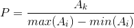
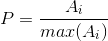
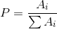
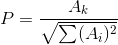

# StudyOpencv
My study opencv 4.1.0 Test Dome
## 01-DisplayImage(图像的操作)
1. 图像的读取 
2. 显示窗口的设置 
3. 图像的显示 
4. 图像的保存 
5. 窗口的销毁。
## 02-ColorSpace(色彩空间的转换)
1. RGB图像转灰度 
2. RGB图像转HSV
## 03-CameraImage(摄像头操作)
1. 设置摄像头参数 
2. 读取摄像头图像 
3. 摄像头图像转换为灰度
## 04-MatCreation(图像的复制与克隆)
1. 创建图像 
2. 填充图像 
3. 图像的复制与克隆
## 05-PixelVisit(像素操作)
1. 获取图像信息 
2. 获取/修改像素值 
3. 图像像素的反向
## 06-Result(图像的运算)
1. 自己实现图像的加法 
2. 图像的加法 
3. 图像的减法 
4. 图像的除法 
5. 图像的乘法
## 07-ColorMap(LUT)
1. 调用系统的LUT实现图像的暖色 
2. 通过LUT自己实现一个二值化函数
## 08-BitWise(图像的逻辑运算)
1. 矩形框的创建 
2. 图像的与/或/异或/取反操作
## 09-SplitMerge(通道的分离与合并)
1. 图像通道分离 
2. 图像通道合并
## 10-CvtColor(图像色彩空间转换)
1. RGB转HSV 
2. RGB转YUV 
3. RGB转YCrCb 
4. 通过HSV提取特定颜色，更换背景
## 11-PixelStatistics(像素统计)
1. 获取图像的最值 
2. 获取灰度图的均值和方差 
3. 通过均值实现图像二值化 
4. 获取彩色图片的均值和方差
## 12-NorMalize(像素归一化)
1. NORM_MINMAX计算公式 

2. NORM_INF计算公式 

3. NORM_L1计算公式 

4. NORM_L2计算公式 

## 13-Capture(视频流操作)
1. 读取视频流并获取视频信息
2. 播放视频，并保存成不同的视频格式
## 14-Flip(图像翻转)
1. 图像的倒影、镜像和对角翻转
## 15-Resize(图像的插值)
1. 利用插值算法实现图像的缩放
2. 最近邻插值、线性插值、三次样条插值、Lanczos插值
## 16-Graph(图形的绘制)
1. 绘制矩形
2. 绘制圆形
3. 绘制椭圆
4. 实现随机线条生成
## 17-ROI(图形ROI区域的操作)
1. 矩形ROI区域
2. 不规则形状ROI(更换人物背景)
